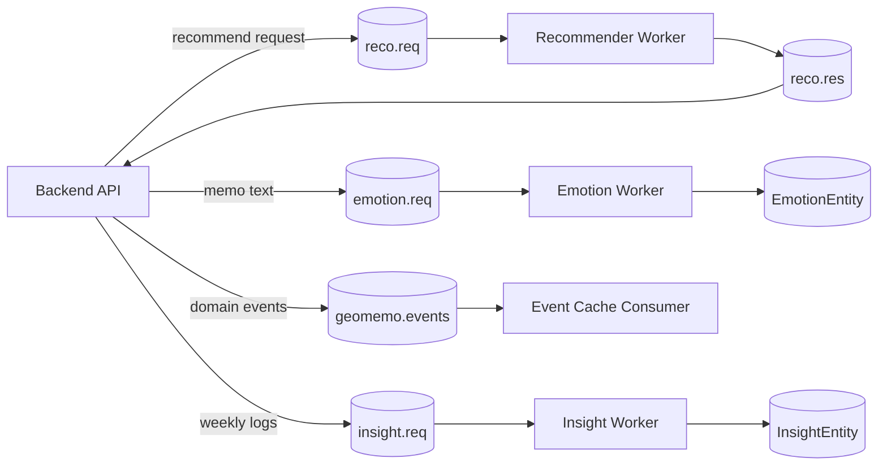

# GeoMemo-AI

GeoMemo-AI는 위치 기반 메모 서비스 **GeoMemo**에서 AI 기능을 담당한 모듈입니다.

사용자가 장소에 남긴 메모를 감정으로 분류하고, 그 감정과 장소 데이터를 이용해 장소 추천과 주간 인사이트를 만듭니다.
백엔드와는 RabbitMQ/Amazon MQ 기반 메시지 큐로 연결되는 구조입니다.

## 주요 기능

### 1. 감정 분석

메모 문장을 아래 6개 감정 라벨 중 하나로 분류합니다.

```text
기쁨 / 놀람 / 분노 / 불안 / 상처 / 슬픔
```

처음 모델은 GPT로 만든 합성 데이터로 학습했기 때문에, 성능 수치를 그대로 믿기보다는 baseline으로 두고 다시 점검했습니다.
원본 데이터 개수, 라벨 분포, 중복, split leakage, 애매한 라벨 경계를 확인했고, 낮은 confidence 예측은 서비스 로직에서 보수적으로 쓰도록 정리했습니다.

관련 문서:

- [docs/EMOTION_WORKER.md](docs/EMOTION_WORKER.md)
- [docs/EMOTION_LABEL_POLICY.md](docs/EMOTION_LABEL_POLICY.md)
- [docs/SYNTHETIC_TRAINING_DATA.md](docs/SYNTHETIC_TRAINING_DATA.md)
- [docs/EMOTION_DATA_AUDIT.md](docs/EMOTION_DATA_AUDIT.md)
- [docs/EMOTION_DATA_CLEANING_AND_REEVAL.md](docs/EMOTION_DATA_CLEANING_AND_REEVAL.md)
- [docs/EMOTION_BOUNDARY_REVIEW.md](docs/EMOTION_BOUNDARY_REVIEW.md)

### 2. 장소 추천

추천은 학습된 ranking model이 아니라, 로그가 부족한 초기 서비스에서 사용할 수 있는 해석 가능한 baseline입니다.

점수에 사용한 신호는 다음과 같습니다.

- 최근 사용자 감정
- 장소별 긍정 메모 비율
- 사용자 카테고리 선호
- 스크랩한 장소
- 팔로우한 사용자의 긍정 반응

관련 문서:

- [docs/RECOMMENDER_POLICY.md](docs/RECOMMENDER_POLICY.md)
- [docs/RECOMMENDER_EVALUATION.md](docs/RECOMMENDER_EVALUATION.md)
- [docs/RECOMMENDER_LOG_SCHEMA.md](docs/RECOMMENDER_LOG_SCHEMA.md)

### 3. 주간 인사이트

주간 인사이트는 사용자의 감정 로그와 장소 카테고리 흐름을 요약합니다.

로그가 적은데도 그럴듯한 패턴을 말해버리면 결과가 불안정해지기 때문에, 최소 데이터 기준을 따로 두었습니다.

- 로그 0개: 개인화 패턴을 말하지 않음
- 로그 1-2개: 가벼운 조언만 제공
- 로그 3-4개: 제한적인 경향만 언급
- 로그 5개 이상: 일반적인 주간 패턴 요약
- 장소 인사이트는 같은 카테고리의 반복 근거가 있을 때만 생성

관련 문서:

- [docs/INSIGHT_POLICY.md](docs/INSIGHT_POLICY.md)

## 실행

### 준비

Python 3.11 이상을 권장합니다.

```bash
pip install -r requirements.txt
cp .env.sample .env
```

`.env`에는 MQ, DB, 모델 경로 값을 채웁니다.
이 파일은 GitHub에 올리지 않습니다.

### worker 실행

```bash
python run_all_workers.py
```

개별 worker는 아래처럼 실행할 수 있습니다.

```bash
python -m ai.recommender.mq_recommender_worker
python -m ai.infra.mq_emotion
python -m ai.infra.mq_insight
python -m ai.infra.mq_consumer
```

실제 MQ/DB 연동은 인프라 설정이 필요합니다.
다만 추천 점수 계산, 감정 메시지 파싱, 인사이트 정책 같은 핵심 로직은 MQ/DB 없이 테스트할 수 있습니다.

## 테스트

```bash
python -m unittest tests.test_recommender
```

현재 테스트에서는 다음을 확인합니다.

- 감정 라벨 정책과 model label order
- 감정 요청 파싱과 confidence/unknown 처리
- 추천 점수 계산
- 낮은 confidence 감정의 추천 반영 강도
- 추천 ranking metric
- interaction log를 evaluation case로 바꾸는 로직
- 주간 인사이트 최소 근거 정책
- 감정 데이터 감사, cleaning, split, boundary review helper

최근 로컬 기준 `30`개 테스트가 통과했습니다.

## 평가 요약

### 감정 데이터 점검

- 원본 행 수: `3,940`
- 중복 제거 후 행 수: `3,843`
- 제거된 중복 행 수: `97`
- 같은 문장인데 라벨이 다른 충돌 사례: `0`
- leakage-safe split: train `3,074`, val `385`, test `384`
- split 간 정확 문장 leakage: `0`

### cleaned test 평가

- Accuracy: `0.8828`
- Macro-F1: `0.8856`
- threshold `0.7` coverage: `0.8542`
- threshold `0.7` accepted accuracy: `0.9207`

주요 혼동은 `상처/슬픔/불안` 경계에서 많이 나왔습니다.
그래서 이 라벨들은 primary/secondary label 관점으로 다시 검토했습니다.

### 감정 경계 검토

- boundary candidate: `54`
- 사람이 `review_label`을 채운 행: `18`
- 실제 라벨 수정으로 본 행: `17`
- `secondary_label`을 남긴 행: `15`
- boundary accuracy: `0.4815` -> `0.7407`

## 구조

```text
GeoMemo-AI/
  ai/
    infra/              # MQ worker, 메시지 파싱, 이벤트 캐시 consumer
    recommender/        # 추천 요청 파서, 점수화 로직, MQ worker
    emotion_policy.py   # 공통 감정 라벨 정책
  data/                 # 공개 샘플 CSV
  dev/                  # 샘플 payload, smoke test, MQ 개발 도구
  docs/                 # 정책 문서, 평가 기록, 메시지 계약
  examples/             # 예시 코드
  scripts/              # 평가, 감사, 데이터 정리 스크립트
  tests/                # DB/MQ 없이 실행되는 단위 테스트
```

자세한 구조는 [docs/PROJECT_STRUCTURE.md](docs/PROJECT_STRUCTURE.md)에 정리했습니다.

## MQ 흐름



메시지 형식은 [docs/MQ_MESSAGE_CONTRACTS.md](docs/MQ_MESSAGE_CONTRACTS.md)에 정리했습니다.

## 공개 저장소에 포함하지 않는 것

- 실제 `.env`
- API key, DB password, credential, service account 파일
- 원본 학습 데이터 CSV/XLSX
- 모델 본체 (`model.safetensors`, `pytorch_model.bin` 등)
- tokenizer/config/vocab 산출물
- 로컬 평가 리포트 (`reports/`)

공개 샘플만 포함합니다.

- `data/sample_emotion_data.csv`
- `data/sample_emotion_domain_eval.csv`

## 문서

- [docs/PUBLIC_RELEASE_CHECKLIST.md](docs/PUBLIC_RELEASE_CHECKLIST.md): 공개 전 체크리스트
- [docs/PUBLIC_RELEASE_AUDIT.md](docs/PUBLIC_RELEASE_AUDIT.md): 공개 점검 기록
- [docs/MQ_MESSAGE_CONTRACTS.md](docs/MQ_MESSAGE_CONTRACTS.md): MQ 메시지 계약
- [docs/EMOTION_CONFIDENCE_POLICY.md](docs/EMOTION_CONFIDENCE_POLICY.md): 낮은 confidence 처리 정책
- [docs/EMOTION_MODEL_IMPROVEMENT.md](docs/EMOTION_MODEL_IMPROVEMENT.md): 모델 개선 계획
- [docs/RECOMMENDER_POLICY.md](docs/RECOMMENDER_POLICY.md): 추천 점수화 정책
- [docs/INSIGHT_POLICY.md](docs/INSIGHT_POLICY.md): 인사이트 최소 근거 정책
