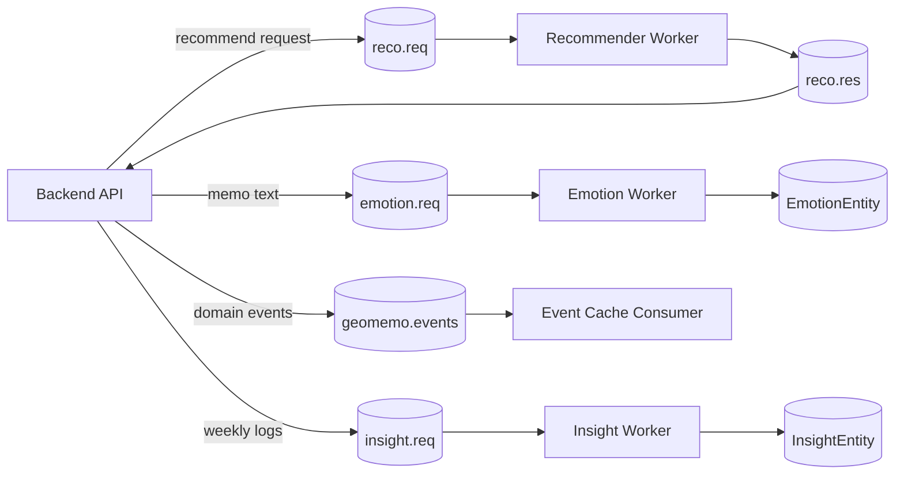

# GeoMemo-AI

GeoMemo-AI is the AI worker module for **GeoMemo**, a location-based memo service. It handles emotion classification for memo text, emotion-aware place recommendation, weekly insight generation, and event-cache updates through RabbitMQ/Amazon MQ style message flows.

This repository is being organized as a portfolio-ready version of the original team project. Runtime code, development tools, tests, local model files, and private datasets are separated so the project can be reviewed without exposing secrets or large artifacts.

## What This Project Shows

- The original team-project AI flow: emotion analysis, emotion-aware recommendation, weekly insight generation, and MQ-based backend integration
- Korean memo emotion classification with a local HuggingFace model
- A service-level emotion policy that separates model labels from product interpretation
- An interpretable baseline recommender using emotion, place sentiment, category preference, scraps, and social signals
- DB/MQ-independent tests for core recommendation, emotion-message, insight-policy, and data-evaluation logic
- Reproducible evaluation scripts for recommendation ranking and emotion-model diagnostics
- A documented security policy for `.env`, credentials, model files, tokenizer artifacts, and private datasets

## Current Status

The project is not presented as a finished production ML system. It is presented as a team-project AI module that was refactored, tested, and critically reviewed for portfolio use.

The portfolio story should include both parts:

- What was implemented in the original team project: AI workers for emotion classification, recommendation, weekly insight, and MQ integration.
- What was improved later for portfolio readiness: structure cleanup, model/data audit, evaluation, confidence handling, label-boundary review, and DB/MQ-free tests.

Key improvements already completed:

- Separated runtime code from development/test utilities.
- Kept large model files and private datasets out of Git.
- Documented the 6-label emotion policy: `기쁨`, `놀람`, `분노`, `불안`, `상처`, `슬픔`.
- Reviewed the original GPT-synthetic emotion data for size, balance, duplication, and quality risk.
- Removed exact duplicate training rows and created leakage-safe train/val/test splits.
- Re-evaluated the local model on both domain samples and cleaned test data.
- Added confidence/unknown handling so low-confidence emotions are used conservatively.
- Reviewed ambiguous `상처/슬픔/불안` boundary cases with primary/secondary emotion notes.
- Added unit tests that run without DB or MQ.

## Core Features

### Emotion Worker

The emotion worker classifies memo text into one of six emotion labels:

```text
기쁨 / 놀람 / 분노 / 불안 / 상처 / 슬픔
```

The model is treated as a **baseline**, not as a fully validated production classifier. The original training data was GPT-synthetic, so the project now includes explicit documentation and evaluation scripts for that limitation.

Important documents:

- [docs/EMOTION_WORKER.md](docs/EMOTION_WORKER.md)
- [docs/EMOTION_LABEL_POLICY.md](docs/EMOTION_LABEL_POLICY.md)
- [docs/EMOTION_LABEL_GUIDELINES.md](docs/EMOTION_LABEL_GUIDELINES.md)
- [docs/SYNTHETIC_TRAINING_DATA.md](docs/SYNTHETIC_TRAINING_DATA.md)
- [docs/EMOTION_DATA_AUDIT.md](docs/EMOTION_DATA_AUDIT.md)
- [docs/EMOTION_DATA_CLEANING_AND_REEVAL.md](docs/EMOTION_DATA_CLEANING_AND_REEVAL.md)
- [docs/EMOTION_BOUNDARY_REVIEW.md](docs/EMOTION_BOUNDARY_REVIEW.md)

### Recommender Worker

The recommender worker computes an interpretable baseline score for candidate places.

Signals include:

- Recent user emotion
- Place-level positive memo ratio
- User category preference
- Scrapped places
- Followed users' positive reactions

This is intentionally documented as a baseline ranking policy, not a trained ranking model. See:

- [docs/RECOMMENDER_POLICY.md](docs/RECOMMENDER_POLICY.md)
- [docs/RECOMMENDER_EVALUATION.md](docs/RECOMMENDER_EVALUATION.md)
- [docs/RECOMMENDER_LOG_SCHEMA.md](docs/RECOMMENDER_LOG_SCHEMA.md)

### Weekly Insight Worker

The insight worker summarizes weekly emotion logs and place-category signals. It avoids overclaiming when there is too little data:

- 0 logs: no personalized pattern claim
- 1-2 logs: light advice only
- 3-4 logs: limited trend
- 5+ logs: normal weekly pattern summary
- Place insight requires repeated evidence from the same category

See [docs/INSIGHT_POLICY.md](docs/INSIGHT_POLICY.md).

## Architecture



Message contracts are documented in [docs/MQ_MESSAGE_CONTRACTS.md](docs/MQ_MESSAGE_CONTRACTS.md).

## Repository Structure

```text
GeoMemo-AI/
  ai/
    infra/              # MQ workers, emotion/insight message parsing, cache consumer
    recommender/        # recommendation schema, parser, scoring logic, MQ worker
    emotion_policy.py   # shared emotion labels, stage1, valence policy
  data/                 # public sample CSVs only; private CSVs are ignored locally
  dev/                  # sample payloads, smoke tests, MQ dev tools
  docs/                 # portfolio notes, policy docs, evaluation records
  examples/             # non-runtime example code
  scripts/              # evaluation, audit, cleaning, and report scripts
  tests/                # DB/MQ-free unit tests
```

Full structure notes are in [docs/PROJECT_STRUCTURE.md](docs/PROJECT_STRUCTURE.md).

## Setup

Python 3.11+ is recommended.

```bash
pip install -r requirements.txt
cp .env.sample .env
```

Do not commit `.env`. It is ignored by Git.

## Running Workers

Run all workers:

```bash
python run_all_workers.py
```

Run workers individually:

```bash
python -m ai.recommender.mq_recommender_worker
python -m ai.infra.mq_emotion
python -m ai.infra.mq_insight
python -m ai.infra.mq_consumer
```

The MQ/DB runtime path requires real infrastructure configuration. The core logic can still be tested locally without MQ or DB.

## Tests

```bash
python -m unittest tests.test_recommender
```

Current unit tests cover:

- Emotion label policy and model label order
- Emotion request parsing and confidence/unknown handling
- Recommendation scoring behavior
- Low-confidence emotion weighting in recommendation
- Recommendation ranking metrics
- Interaction-log to evaluation-case conversion
- Insight minimum-evidence policy
- MQ-independent insight request parsing
- Emotion data audit, cleaning, leakage-safe split, and boundary-review evaluation helpers

Latest local status: `30` tests passing.

## Emotion Evaluation Summary

Original synthetic training data audit:

- Source rows: `3,940`
- Cleaned rows after exact duplicate removal: `3,843`
- Removed duplicate rows: `97`
- Same text with different labels: `0`
- Leakage-safe split: train `3,074`, val `385`, test `384`
- Exact text leakage across splits: `0`

Cleaned test model evaluation:

- Accuracy: `0.8828`
- Macro-F1: `0.8856`
- Main confusion pairs: `기쁨 -> 놀람`, `상처 -> 슬픔`, `슬픔 -> 불안`, `슬픔 -> 상처`
- Threshold `0.7`: coverage `0.8542`, accepted accuracy `0.9207`

Boundary review:

- Boundary candidates reviewed: `54`
- Rows with human `review_label`: `18`
- Actual label corrections: `17`
- Rows with `secondary_label`: `15`
- Boundary accuracy changed from `0.4815` to `0.7407` after reviewed labels were applied

Interpretation: the current model is usable as a **portfolio baseline**, but real service quality should not be claimed without more real or human-labeled memo data. The next model-improvement target is the boundary between `상처`, `슬픔`, and `불안`.

## Recommendation Evaluation

Sample recommendation metrics can be computed with:

```bash
python scripts/evaluate_recommender.py --cases dev/sample_payloads/reco_eval_cases.json --k 3
```

Interaction logs can be converted into evaluation cases:

```bash
python scripts/build_recommender_eval_cases.py --logs dev/sample_payloads/reco_interaction_logs_sample.json --out dev/sample_payloads/reco_eval_cases_from_logs.json
```

## Model And Data Policy

The public repository should not include local secrets, model bodies, tokenizer artifacts, or private datasets.

- `.env`, API keys, DB passwords, credentials, and service account files are ignored.
- `kc_saved_model/` keeps only `.gitkeep`; actual model files stay local.
- `artifacts/model_tokenizer/` keeps only `.gitkeep`; actual tokenizer/config exports stay local.
- Private CSV/XLSX files under `data/` are ignored.
- Public sample files are explicitly allowed:
  - `data/sample_emotion_data.csv`
  - `data/sample_emotion_domain_eval.csv`
- Local reports under `reports/` are ignored.

## Documentation

- [docs/PROJECT_STRUCTURE.md](docs/PROJECT_STRUCTURE.md): folder and file roles
- [docs/PUBLIC_RELEASE_CHECKLIST.md](docs/PUBLIC_RELEASE_CHECKLIST.md): GitHub release safety checklist
- [docs/PUBLIC_RELEASE_AUDIT.md](docs/PUBLIC_RELEASE_AUDIT.md): latest public-release audit results
- [docs/MQ_MESSAGE_CONTRACTS.md](docs/MQ_MESSAGE_CONTRACTS.md): MQ message contracts
- [docs/EMOTION_WORKER.md](docs/EMOTION_WORKER.md): emotion worker I/O and model requirements
- [docs/EMOTION_LABEL_POLICY.md](docs/EMOTION_LABEL_POLICY.md): 6-label policy and `놀람` rationale
- [docs/EMOTION_LABEL_GUIDELINES.md](docs/EMOTION_LABEL_GUIDELINES.md): primary/secondary emotion labeling guide
- [docs/SYNTHETIC_TRAINING_DATA.md](docs/SYNTHETIC_TRAINING_DATA.md): GPT-synthetic data limitation
- [docs/EMOTION_DATA_AUDIT.md](docs/EMOTION_DATA_AUDIT.md): original data audit
- [docs/EMOTION_DATA_CLEANING_AND_REEVAL.md](docs/EMOTION_DATA_CLEANING_AND_REEVAL.md): cleaned split and re-evaluation
- [docs/EMOTION_BOUNDARY_REVIEW.md](docs/EMOTION_BOUNDARY_REVIEW.md): human review of ambiguous emotion boundaries
- [docs/EMOTION_CONFIDENCE_POLICY.md](docs/EMOTION_CONFIDENCE_POLICY.md): low-confidence handling
- [docs/EMOTION_MODEL_IMPROVEMENT.md](docs/EMOTION_MODEL_IMPROVEMENT.md): model improvement plan
- [docs/INSIGHT_POLICY.md](docs/INSIGHT_POLICY.md): weekly insight minimum-evidence policy
- [docs/RECOMMENDER_POLICY.md](docs/RECOMMENDER_POLICY.md): recommendation scoring policy
- [docs/RECOMMENDER_EVALUATION.md](docs/RECOMMENDER_EVALUATION.md): recommendation evaluation method
- [docs/RECOMMENDER_LOG_SCHEMA.md](docs/RECOMMENDER_LOG_SCHEMA.md): implicit-feedback log schema

## Portfolio Framing

GeoMemo-AI is strongest when explained as a project where the AI workflow was not only implemented, but later reviewed critically:

> I treated the original emotion model as a baseline rather than a final answer. Because the training data was GPT-synthetic, I audited the source data, removed duplicate rows, rebuilt leakage-safe splits, re-evaluated the model, added confidence-aware downstream handling, and manually reviewed ambiguous emotion-boundary cases. This made the AI module more explainable, testable, and honest for portfolio use.
