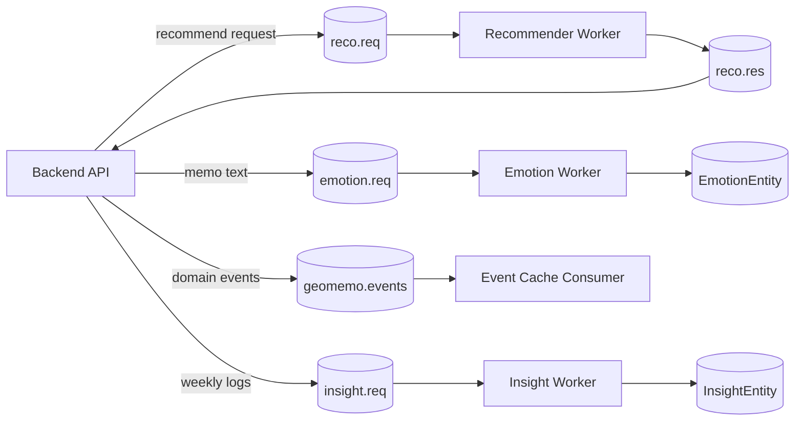

# GeoMemo-AI

GeoMemo-AI는 위치 기반 메모 서비스 **GeoMemo**의 AI worker 모듈입니다.
사용자가 남긴 메모의 감정을 분석하고, 감정과 장소 맥락을 활용해 장소 추천과 주간 인사이트 생성을 수행합니다.
백엔드와는 RabbitMQ/Amazon MQ 형태의 메시지 큐를 통해 비동기적으로 연동되는 구조를 전제로 합니다.

이 저장소에는 공개 가능한 코드, 샘플 데이터, 테스트, 기술 문서만 포함되어 있습니다.
실제 `.env`, API key, DB password, 원본 학습 데이터, 모델 본체, tokenizer 산출물은 GitHub에 올리지 않습니다.

## 프로젝트에서 보여주는 것

- 위치 기반 메모 서비스의 AI worker 구조
- 한국어 메모 문장을 6개 감정 라벨로 분류하는 감정 분석 worker
- 감정, 장소 선호, 스크랩, 팔로우 사용자 반응을 조합한 해석 가능한 추천 baseline
- 로그가 부족할 때 과장된 해석을 피하는 주간 인사이트 정책
- MQ/DB 없이도 핵심 로직을 검증할 수 있는 단위 테스트
- 합성 데이터 기반 모델의 한계를 인정하고 보완한 데이터 감사, 재평가, confidence 정책

## 현재 상태

이 프로젝트는 완성된 production ML 시스템이라기보다, 팀 프로젝트에서 구현한 AI 모듈을 공개 가능한 구조로 정리하고 검증한 버전입니다.

주요 정리 및 보완 내용은 다음과 같습니다.

- 런타임 코드와 개발용 도구를 분리했습니다.
- 대용량 모델 파일과 private dataset을 Git에서 제외했습니다.
- 감정 라벨 체계를 `기쁨`, `놀람`, `분노`, `불안`, `상처`, `슬픔` 6개로 명확히 문서화했습니다.
- GPT 합성 데이터로 학습한 모델이라는 한계를 숨기지 않고 데이터 품질과 중복 여부를 점검했습니다.
- 중복 제거 후 leakage-safe train/val/test split을 다시 만들었습니다.
- cleaned test와 도메인 샘플 기준으로 모델을 재평가했습니다.
- 낮은 confidence의 감정 예측은 추천에 약하게 반영하도록 보수적인 정책을 추가했습니다.
- `상처/슬픔/불안`처럼 경계가 애매한 감정 사례를 primary/secondary label 관점으로 검토했습니다.
- DB와 MQ 없이 실행되는 단위 테스트를 추가했습니다.

## 핵심 기능

### 감정 분석 worker

감정 분석 worker는 메모 텍스트를 다음 6개 라벨 중 하나로 분류합니다.

```text
기쁨 / 놀람 / 분노 / 불안 / 상처 / 슬픔
```

현재 모델은 최종 production classifier가 아니라 baseline으로 다룹니다.
초기 학습 데이터가 GPT 합성 데이터였기 때문에 실제 사용자 메모에 대한 일반화 성능은 별도 검증이 필요합니다.
이 한계를 보완하기 위해 데이터 감사, cleaned split, 도메인 평가, confidence 정책, 감정 경계 검토 문서를 함께 정리했습니다.

관련 문서:

- [docs/EMOTION_WORKER.md](docs/EMOTION_WORKER.md)
- [docs/EMOTION_LABEL_POLICY.md](docs/EMOTION_LABEL_POLICY.md)
- [docs/EMOTION_LABEL_GUIDELINES.md](docs/EMOTION_LABEL_GUIDELINES.md)
- [docs/SYNTHETIC_TRAINING_DATA.md](docs/SYNTHETIC_TRAINING_DATA.md)
- [docs/EMOTION_DATA_AUDIT.md](docs/EMOTION_DATA_AUDIT.md)
- [docs/EMOTION_DATA_CLEANING_AND_REEVAL.md](docs/EMOTION_DATA_CLEANING_AND_REEVAL.md)
- [docs/EMOTION_BOUNDARY_REVIEW.md](docs/EMOTION_BOUNDARY_REVIEW.md)

### 추천 worker

추천 worker는 후보 장소에 대해 해석 가능한 baseline 점수를 계산합니다.

사용하는 주요 신호는 다음과 같습니다.

- 최근 사용자 감정
- 장소별 긍정 메모 비율
- 사용자 카테고리 선호
- 사용자가 스크랩한 장소
- 팔로우한 사용자의 긍정 반응

이 추천 로직은 학습된 ranking model이 아니라, 로그가 부족한 초기 서비스에서 사용할 수 있는 정책 기반 baseline입니다.
점수화 기준과 평가 방식은 별도 문서로 남겼습니다.

관련 문서:

- [docs/RECOMMENDER_POLICY.md](docs/RECOMMENDER_POLICY.md)
- [docs/RECOMMENDER_EVALUATION.md](docs/RECOMMENDER_EVALUATION.md)
- [docs/RECOMMENDER_LOG_SCHEMA.md](docs/RECOMMENDER_LOG_SCHEMA.md)

### 주간 인사이트 worker

주간 인사이트 worker는 사용자의 감정 로그와 장소 카테고리 신호를 요약합니다.
데이터가 적을 때 무리한 패턴을 주장하지 않도록 최소 근거 기준을 둡니다.

- 로그 0개: 개인화 패턴 주장 없음
- 로그 1-2개: 가벼운 조언만 제공
- 로그 3-4개: 제한적인 경향만 언급
- 로그 5개 이상: 일반적인 주간 패턴 요약
- 장소 인사이트는 같은 카테고리의 반복 근거가 있을 때만 생성

관련 문서:

- [docs/INSIGHT_POLICY.md](docs/INSIGHT_POLICY.md)

## 아키텍처



메시지 계약은 [docs/MQ_MESSAGE_CONTRACTS.md](docs/MQ_MESSAGE_CONTRACTS.md)에 정리되어 있습니다.

## 폴더 구조

```text
GeoMemo-AI/
  ai/
    infra/              # MQ worker, 감정/인사이트 메시지 파싱, 이벤트 캐시 consumer
    recommender/        # 추천 schema, 요청 파서, 점수화 로직, MQ worker
    emotion_policy.py   # 공통 감정 라벨, stage1, valence 정책
  data/                 # 공개 샘플 CSV만 포함, private CSV는 로컬에서 제외
  dev/                  # 샘플 payload, smoke test, MQ 개발 도구
  docs/                 # 정책 문서, 평가 기록, 메시지 계약 문서
  examples/             # 런타임이 아닌 예시 코드
  scripts/              # 평가, 감사, 데이터 정리 스크립트
  tests/                # DB/MQ 없이 실행되는 단위 테스트
```

자세한 구조는 [docs/PROJECT_STRUCTURE.md](docs/PROJECT_STRUCTURE.md)를 참고합니다.

## 실행 준비

Python 3.11 이상을 권장합니다.

```bash
pip install -r requirements.txt
cp .env.sample .env
```

`.env`는 Git에 커밋하지 않습니다.

## worker 실행

전체 worker 실행:

```bash
python run_all_workers.py
```

개별 worker 실행:

```bash
python -m ai.recommender.mq_recommender_worker
python -m ai.infra.mq_emotion
python -m ai.infra.mq_insight
python -m ai.infra.mq_consumer
```

실제 MQ/DB 연동 경로는 운영 환경 설정이 필요합니다.
다만 추천, 감정 메시지 파싱, 인사이트 정책 같은 핵심 로직은 MQ/DB 없이 로컬 테스트가 가능합니다.

## 테스트

```bash
python -m unittest tests.test_recommender
```

현재 단위 테스트는 다음 항목을 검증합니다.

- 감정 라벨 정책과 모델 label order
- 감정 요청 파싱과 confidence/unknown 처리
- 추천 점수화 동작
- 낮은 confidence 감정의 추천 반영 강도
- 추천 ranking metric
- interaction log를 평가 case로 변환하는 로직
- 주간 인사이트 최소 근거 정책
- MQ 없이 실행되는 인사이트 요청 파싱
- 감정 데이터 감사, cleaning, leakage-safe split, boundary review helper

최근 로컬 기준 `30`개 테스트가 통과했습니다.

## 감정 모델 평가 요약

원본 합성 학습 데이터 감사 결과:

- 원본 행 수: `3,940`
- 정확 중복 제거 후 행 수: `3,843`
- 제거된 중복 행 수: `97`
- 같은 문장인데 라벨이 다른 충돌 사례: `0`
- leakage-safe split: train `3,074`, val `385`, test `384`
- split 간 정확 문장 leakage: `0`

cleaned test 기준 모델 평가:

- Accuracy: `0.8828`
- Macro-F1: `0.8856`
- 주요 혼동: `기쁨 -> 놀람`, `상처 -> 슬픔`, `슬픔 -> 불안`, `슬픔 -> 상처`
- threshold `0.7`: coverage `0.8542`, accepted accuracy `0.9207`

감정 경계 검토 결과:

- 검토한 boundary candidate: `54`
- 사람이 `review_label`을 채운 행: `18`
- 실제 라벨 수정으로 판단한 행: `17`
- `secondary_label`을 남긴 행: `15`
- reviewed label 적용 전후 boundary accuracy: `0.4815` -> `0.7407`

해석:
현재 모델은 baseline으로는 유지할 수 있지만, 실제 서비스 품질을 주장하려면 더 많은 실제 사용자 메모 또는 사람이 라벨링한 도메인 데이터가 필요합니다.
다음 개선 대상은 `상처`, `슬픔`, `불안`의 경계입니다.

## 추천 평가

샘플 추천 평가:

```bash
python scripts/evaluate_recommender.py --cases dev/sample_payloads/reco_eval_cases.json --k 3
```

interaction log를 추천 평가 case로 변환:

```bash
python scripts/build_recommender_eval_cases.py --logs dev/sample_payloads/reco_interaction_logs_sample.json --out dev/sample_payloads/reco_eval_cases_from_logs.json
```

## 모델 및 데이터 공개 정책

공개 저장소에는 local secret, 모델 본체, tokenizer 산출물, private dataset을 포함하지 않습니다.

- `.env`, API key, DB password, credential, service account 파일은 제외합니다.
- `kc_saved_model/`에는 `.gitkeep`만 남기고 실제 모델 파일은 로컬에 보관합니다.
- `artifacts/model_tokenizer/`에는 `.gitkeep`만 남기고 실제 tokenizer/config 산출물은 로컬에 보관합니다.
- `data/` 아래 private CSV/XLSX 파일은 제외합니다.
- 공개 가능한 샘플 파일만 예외로 포함합니다.
  - `data/sample_emotion_data.csv`
  - `data/sample_emotion_domain_eval.csv`
- 로컬 평가 산출물인 `reports/`는 제외합니다.

## 문서

- [docs/PROJECT_STRUCTURE.md](docs/PROJECT_STRUCTURE.md): 프로젝트 폴더 구조
- [docs/PUBLIC_RELEASE_CHECKLIST.md](docs/PUBLIC_RELEASE_CHECKLIST.md): GitHub 공개 전 체크리스트
- [docs/PUBLIC_RELEASE_AUDIT.md](docs/PUBLIC_RELEASE_AUDIT.md): 공개 점검 기록
- [docs/MQ_MESSAGE_CONTRACTS.md](docs/MQ_MESSAGE_CONTRACTS.md): MQ 메시지 계약
- [docs/EMOTION_WORKER.md](docs/EMOTION_WORKER.md): 감정 분석 worker 입출력과 모델 요구사항
- [docs/EMOTION_LABEL_POLICY.md](docs/EMOTION_LABEL_POLICY.md): 6개 감정 라벨 정책
- [docs/EMOTION_LABEL_GUIDELINES.md](docs/EMOTION_LABEL_GUIDELINES.md): primary/secondary 감정 라벨링 기준
- [docs/SYNTHETIC_TRAINING_DATA.md](docs/SYNTHETIC_TRAINING_DATA.md): GPT 합성 데이터 사용 한계
- [docs/EMOTION_DATA_AUDIT.md](docs/EMOTION_DATA_AUDIT.md): 원본 데이터 감사
- [docs/EMOTION_DATA_CLEANING_AND_REEVAL.md](docs/EMOTION_DATA_CLEANING_AND_REEVAL.md): cleaned split과 재평가
- [docs/EMOTION_BOUNDARY_REVIEW.md](docs/EMOTION_BOUNDARY_REVIEW.md): 애매한 감정 경계 검토
- [docs/EMOTION_CONFIDENCE_POLICY.md](docs/EMOTION_CONFIDENCE_POLICY.md): 낮은 confidence 처리 정책
- [docs/EMOTION_MODEL_IMPROVEMENT.md](docs/EMOTION_MODEL_IMPROVEMENT.md): 모델 개선 계획
- [docs/INSIGHT_POLICY.md](docs/INSIGHT_POLICY.md): 주간 인사이트 최소 근거 정책
- [docs/RECOMMENDER_POLICY.md](docs/RECOMMENDER_POLICY.md): 추천 점수화 정책
- [docs/RECOMMENDER_EVALUATION.md](docs/RECOMMENDER_EVALUATION.md): 추천 평가 방식
- [docs/RECOMMENDER_LOG_SCHEMA.md](docs/RECOMMENDER_LOG_SCHEMA.md): implicit feedback 로그 schema
